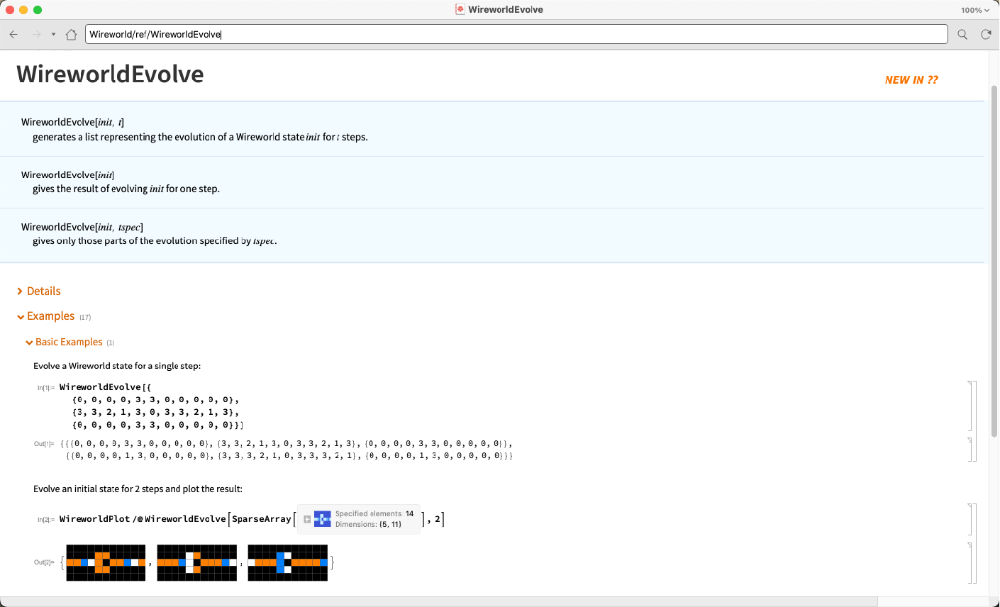
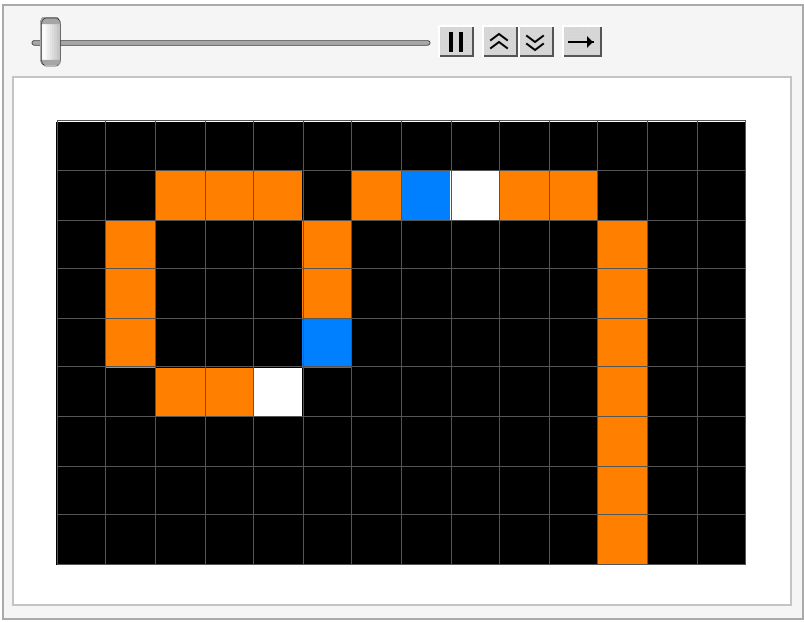
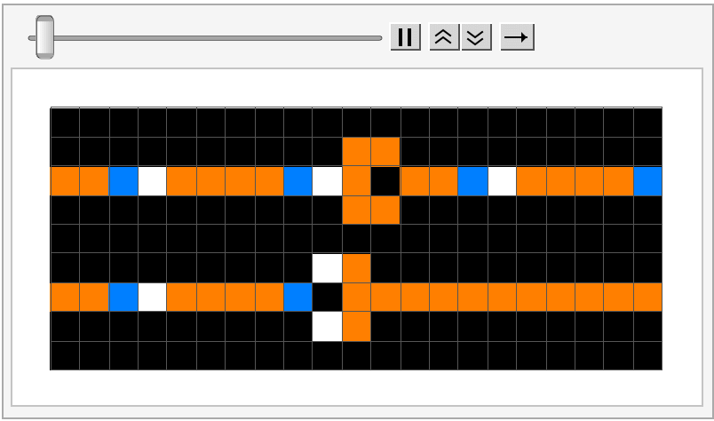
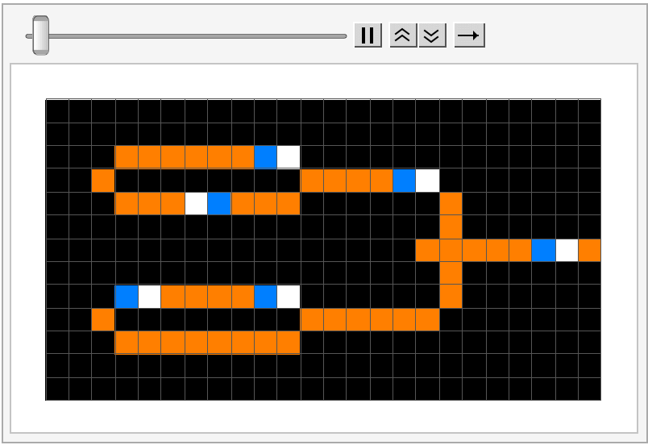

# Wireworld

Wireworld is a Turing-complete cellular automaton first proposed by Brian Silverman in 1987 suited for simulating logic gates and other real-world computer elements.

## Installation

Install the paclet (version `1.0.0`) from github releases:
```Mathematica
PacletInstall["https://github.com/daneelsan/Wireworld/releases/download/v1.0.0/Wireworld-1.0.0.paclet"]
```

## Usage

Load the Wireworld` package:
```Mathematica
Needs["Wireworld`"]
```

Wireworld symbols:
```Mathematica
In[]:= Names["Wireworld`*"]
Out[]= {
	"WireworldDraw",
	"WireworldEvolve",
	"WireworldPlot",
	"WireworldStateQ",
	"$WireworldFunctionRule",
	"$WireworldNumberRule",
	"$WireworldRule"
}
```

Open the documentation of the `WireworldEvolve` function:
```Mathematica
NotebookOpen[Information[WireworldEvolve, "Documentation"]["Local"]]
```


## Examples

### A Clock Generator

A period 12 electron clock generator:
```Mathematica
In[]:= state = {
	{0, 0, 0, 0, 0, 0, 0, 0, 0, 0, 0, 0, 0, 0},
	{0, 0, 3, 3, 3, 0, 3, 2, 1, 3, 3, 0, 0, 0},
	{0, 3, 0, 0, 0, 3, 0, 0, 0, 0, 0, 3, 0, 0},
	{0, 3, 0, 0, 0, 3, 0, 0, 0, 0, 0, 3, 0, 0},
	{0, 3, 0, 0, 0, 2, 0, 0, 0, 0, 0, 3, 0, 0},
	{0, 0, 3, 3, 1, 0, 0, 0, 0, 0, 0, 3, 0, 0},
	{0, 0, 0, 0, 0, 0, 0, 0, 0, 0, 0, 3, 0, 0},
	{0, 0, 0, 0, 0, 0, 0, 0, 0, 0, 0, 3, 0, 0},
	{0, 0, 0, 0, 0, 0, 0, 0, 0, 0, 0, 3, 0, 0}
};

In[]:= ListAnimate[WireworldPlot /@ WireworldEvolve[state, 11]]
```


### The Diode

A diode allows electrons to flow in only one direction:
```Mathematica
In[]:= state = {
	{0, 0, 0, 0, 0, 0, 0, 0, 0, 0, 0, 0, 0, 0, 0, 0, 0, 0, 0, 0, 0},
	{0, 0, 0, 0, 0, 0, 0, 0, 0, 0, 3, 3, 0, 0, 0, 0, 0, 0, 0, 0, 0},
	{3, 3, 2, 1, 3, 3, 3, 3, 2, 1, 3, 0, 3, 3, 2, 1, 3, 3, 3, 3, 2},
	{0, 0, 0, 0, 0, 0, 0, 0, 0, 0, 3, 3, 0, 0, 0, 0, 0, 0, 0, 0, 0},
	{0, 0, 0, 0, 0, 0, 0, 0, 0, 0, 0, 0, 0, 0, 0, 0, 0, 0, 0, 0, 0},
	{0, 0, 0, 0, 0, 0, 0, 0, 0, 1, 3, 0, 0, 0, 0, 0, 0, 0, 0, 0, 0},
	{3, 3, 2, 1, 3, 3, 3, 3, 2, 0, 3, 3, 3, 3, 3, 3, 3, 3, 3, 3, 3},
	{0, 0, 0, 0, 0, 0, 0, 0, 0, 1, 3, 0, 0, 0, 0, 0, 0, 0, 0, 0, 0},
	{0, 0, 0, 0, 0, 0, 0, 0, 0, 0, 0, 0, 0, 0, 0, 0, 0, 0, 0, 0, 0}
};

In[]:= ListAnimate[WireworldPlot /@ WireworldEvolve[state, 8]]
```


### The OR gate
Two clock generators sending electrons into an OR gate:
```Mathematica
In[]:= state = {
	{0, 0, 0, 0, 0, 0, 0, 0, 0, 0, 0, 0, 0, 0, 0, 0, 0, 0, 0, 0, 0, 0, 0, 0},
	{0, 0, 0, 0, 0, 0, 0, 0, 0, 0, 0, 0, 0, 0, 0, 0, 0, 0, 0, 0, 0, 0, 0, 0},
	{0, 0, 0, 3, 3, 3, 3, 3, 3, 2, 1, 0, 0, 0, 0, 0, 0, 0, 0, 0, 0, 0, 0, 0},
	{0, 0, 3, 0, 0, 0, 0, 0, 0, 0, 0, 3, 3, 3, 3, 2, 1, 0, 0, 0, 0, 0, 0, 0},
	{0, 0, 0, 3, 3, 3, 1, 2, 3, 3, 3, 0, 0, 0, 0, 0, 0, 3, 0, 0, 0, 0, 0, 0},
	{0, 0, 0, 0, 0, 0, 0, 0, 0, 0, 0, 0, 0, 0, 0, 0, 0, 3, 0, 0, 0, 0, 0, 0},
	{0, 0, 0, 0, 0, 0, 0, 0, 0, 0, 0, 0, 0, 0, 0, 0, 3, 3, 3, 3, 3, 2, 1, 3},
	{0, 0, 0, 0, 0, 0, 0, 0, 0, 0, 0, 0, 0, 0, 0, 0, 0, 3, 0, 0, 0, 0, 0, 0},
	{0, 0, 0, 2, 1, 3, 3, 3, 3, 2, 1, 0, 0, 0, 0, 0, 0, 3, 0, 0, 0, 0, 0, 0},
	{0, 0, 3, 0, 0, 0, 0, 0, 0, 0, 0, 3, 3, 3, 3, 3, 3, 0, 0, 0, 0, 0, 0, 0},
	{0, 0, 0, 3, 3, 3, 3, 3, 3, 3, 3, 0, 0, 0, 0, 0, 0, 0, 0, 0, 0, 0, 0, 0},
	{0, 0, 0, 0, 0, 0, 0, 0, 0, 0, 0, 0, 0, 0, 0, 0, 0, 0, 0, 0, 0, 0, 0, 0},
	{0, 0, 0, 0, 0, 0, 0, 0, 0, 0, 0, 0, 0, 0, 0, 0, 0, 0, 0, 0, 0, 0, 0, 0}
};

In[]:= ListAnimate[WireworldPlot /@ WireworldEvolve[state, 20]]
```


## Wolfram Paclet Repository

A copy of the lastest released paclet is in the Wolfram Paclet Repository (WPR):
https://resources.wolframcloud.com/PacletRepository/resources/DanielS/Wireworld/

## Build

1. Build the `Wireworld` paclet using the `build_paclet.wls` wolframscript:
```bash
./scripts/build_paclet.wls
```
   The paclet will be placed under the `build` directory:
```bash
$ ls build/*.paclet
build/Wireworld-1.0.0.paclet
```

2. Install the built paclet:
```Mathematica
PacletInstall["./build/Wireworld-1.0.0.paclet"]
```

3. (Optional) Build the `LibraryLink` library by running the `build_library.wls` script to use the ```Wireworld`Library`WireworldStep``` function:
```bash
./scripts/build_library.wls
```
   The library will be stored in `LibraryResources/$SystemID/`:
```bash
$ ls LibraryResources/MacOSX-ARM64
libWireworld.dylib
```
